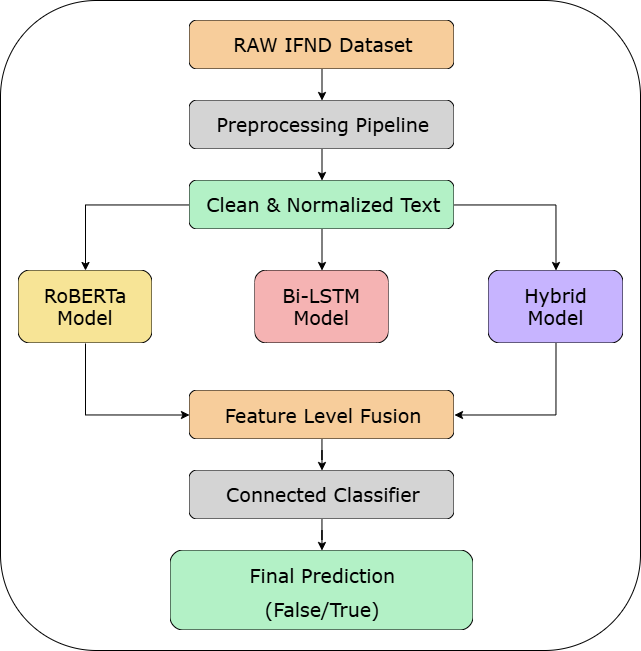

# Deepfake-News Shield: Detecting False Articles and Manipulated Photos

Deepfake-News Shield is a complete deep learning system designed to detect misleading, fabricated and manipulated news content.
It focuses on cleaning noisy text, training multiple neural models, and combining them using a feature-level fusion strategy to produce reliable fake/real predictions.

---

## 📌 Problem Statement

Fake news spreads rapidly across the internet and easily influences public opinion.
When false articles are supported with edited or manipulated photos, they appear even more convincing.
Manually verifying every piece of information becomes impossible when the volume is huge.

Because of this, there is a strong need for an **automated deep learning system capable of detecting both fake text and manipulated media with high accuracy**.
This project represents the first phase — focusing on **text-based fake news detection** using the IFND dataset.

---

## 🎯 Core Objectives

**1.** To preprocess the IFND dataset by removing noise and fixing text inconsistencies for cleaner model input.

**2.** To design and train deep learning models for fake-news classification.

**3.** To compare model performances and identify the best two for fusion.

**4.** To build a feature-level fusion model that combines strengths of both models for improved reliability.

**5.** To extend the same fusion approach to images in the next phase of the project.


---

## ✨ Key Features

### Robust Preprocessing Pipeline

* Repairs Unicode issues and corrupted characters
* Removes HTML tags, boilerplate text, and embedded metadata
* Applies duplicate and near-duplicate detection
* Normalizes special symbols, punctuation, and numerical patterns
* Replaces URLs, emails and mentions with placeholders
* Enforces a token length suitable for transformers

### Multiple Model Architectures

* **RoBERTa Transformer** for contextual understanding
* **Bi-LSTM Model** for sequence-level learning
* **Hybrid Model** combining Bi-LSTM, Attention and GRU
* **Feature-level fusion** combining embeddings from the above models

### Fusion-Based Classification

* Extracts features from RoBERTa, Bi-LSTM and Hybrid models
* Merges them into an 896-dimensional vector
* Sends the fused vector into a two-layer MLP classifier

---

## 🏗️ System Architecture

Below is the architecture rewritten and formatted based on your slide diagrams:


<p align="center">
  
</p>


**Fusion Classifier:**

* Dense Layer 1: 896 → 256
* Activation: ReLU + Dropout
* Dense Layer 2: 256 → 2
* Output: Softmax (TRUE / FALSE)

---

## 📊 Dataset Details

### IFND (Indian Fake News Dataset)

* **Total Samples:** 56,868 articles
* **Years Covered:** 2013–2021
* **Labels:** TRUE, FALSE
* **Split:** 80% training, 10% validation, 10% testing
* **Fields:** Text content, label, category, URL, date, optional image

The dataset reflects real-world misinformation, including political, social and health-related fake articles.

---

## 🧼 Preprocessing Summary

A refined 16-step pipeline was applied to ensure all samples meet model input requirements.
Major improvements include:

* Removing repeated and boilerplate news text
* Cleaning corrupted symbols, HTML tags and old encodings
* Standardizing apostrophes, punctuation and spacing
* Enforcing consistent numerical formatting
* Cleaning URLs, emails, hashtags and handles
* Ensuring samples fall within the maximum transformer token limit

---

## 🤖 Model Innovations

### RoBERTa Transformer

Captures deeper semantic meaning and long-range dependencies in text.

### Bi-LSTM Model

Learns sequential patterns and word relationships across sentences.

### Hybrid Bi-LSTM + Attention + GRU

* Bi-LSTM for context
* Attention to highlight the most relevant words
* GRU for additional refinement
  This architecture performs well even with noisy or emotionally charged text.

### Feature-Level Fusion

Instead of selecting one model, the fusion technique merges multiple feature spaces into a unified representation, strengthening model reliability and reducing overfitting.

---

## 📈 Results

### Best Fusion Model Scores

| Metric           | Score  |
| ---------------- | ------ |
| Accuracy         | 0.9797 |
| ROC-AUC          | 0.9901 |
| Macro F1         | 0.9761 |
| Precision (True) | 0.98   |
| Recall (True)    | 0.99   |

### Confusion Matrix (Fusion):
```
 [ [1554   77  ]
   [ 30    3615] ]
```
### Performance Highlights

* Fusion significantly outperforms single models
* Transformer + Hybrid yields the best complementary strengths
* No major overfitting observed
* Works well across different categories of misinformation

---

## 🚀 Installation

### Requirements

* Python 3.8+
* CUDA-supported GPU recommended
* At least 16 GB RAM

### Setup

```
git clone https://github.com/yourusername/deepfake-news-shield
cd deepfake-news-shield

python -m venv venv
source venv/bin/activate      # Windows: venv\Scripts\activate
pip install -r requirements.txt
```

---

## 💻 Usage

### Preprocess the Dataset

```
python src/preprocessing.py --input data/IFND.csv --output data/IFND_clean.csv
```

### Train All Models

```
python experiments/Collab_notebook_sem7.py
```

### Example Inference

```python
from src.infer import FusionInference

detector = FusionInference(
    roberta_path="models/roberta-best.pt",
    hybrid_path="models/hybrid-best.pt",
    fusion_path="models/fusion-best.pt"
)

text = "Breaking: Shocking new policy announced by government."
result = detector.predict(text)

print(result["label"], result["probability"])
```

---

## 📚 Documentation

This repository includes:

* Major project report (methodology + results)
* Presentation slides
* Notebooks for training, preprocessing and evaluation
* Scripts for model training and inference

---

## 🔮 Future Work

* Add image-based fake detection using Vision Transformers
* Develop a browser extension for real-time fact verification
* Integrate third-party fact-checking APIs
* Expand the dataset and include regional languages
* Build a full-stack demo interface for public interaction

---

## 👥 Contributors

Developed as a B.Tech major project at **Jaypee University of Information Technology** (July-December 2025)

**Team Members:**
- **Madhav** (221030283)
- **Soha Khan** (221031049)
- **Harshit Thakur** (221031013)
- **Divyam Saini** (221030070)

**Supervisor:**  
Dr. Deepak Gupta, Assistant Professor (SG)  
Department of CSE & IT, JUIT, Waknaghat

---

## 🙏 Acknowledgments

We thank:
- **Dr. Deepak Gupta** for invaluable guidance
- **JUIT** for computational resources
- The creators of the **IFND dataset**

---

## 📄 License

This project is licensed under the MIT License - see [LICENSE](LICENSE) file for details.

---
